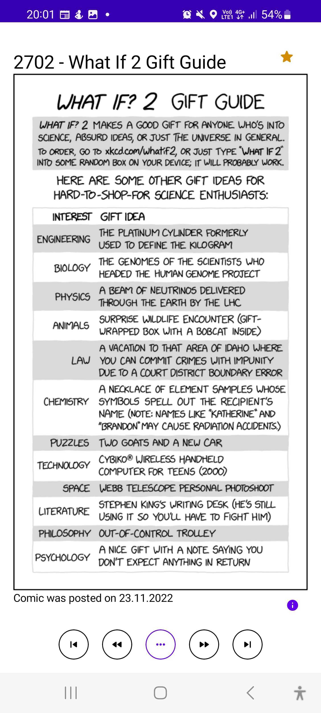
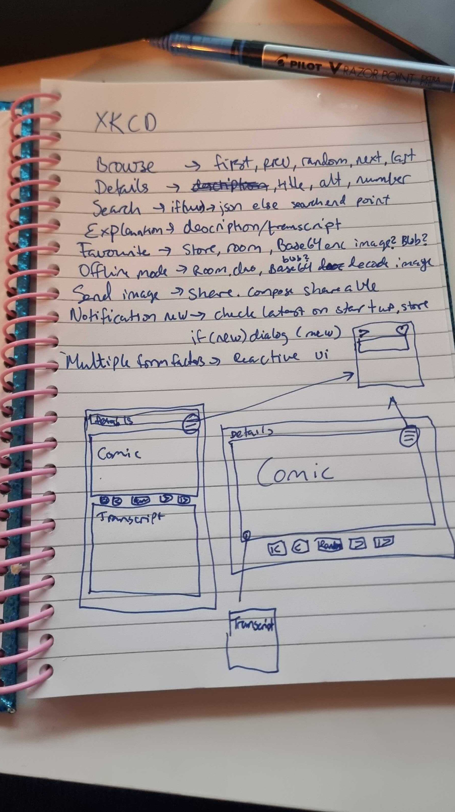
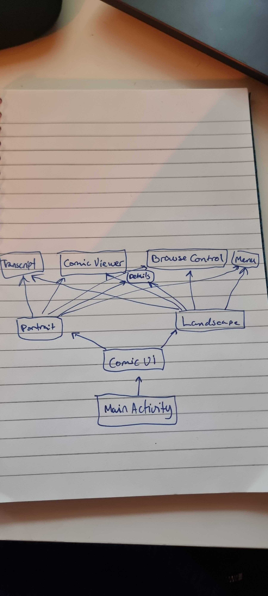
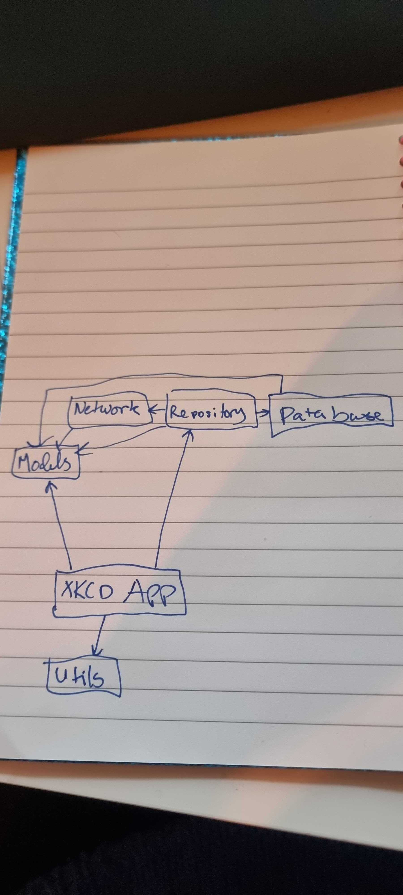
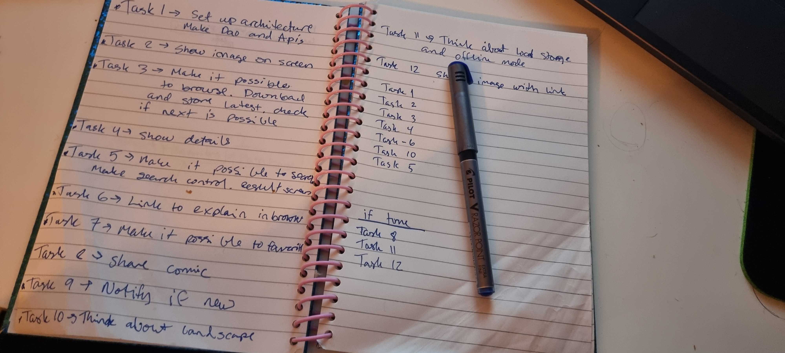

# xkcdapp
The challenge!

## The Challenge

A client of ours has just discovered [xkcd comics](https://xkcd.com/).

  

Disregarding the abundance of similar apps, she wants to create a comic viewer app, right now! She came up with a list of requirements, too! The user should be able to:

- browse through the comics,
- see the comic details, including its description,
- search for comics by the comic number as well as text,
- get the comic explanation
- favorite the comics, which would be available offline too,
- send comics to others,
- get notifications when a new comic is published,
- support multiple form factors.

Quite a list! :scream:

Luckily, there are a few services available to ease some of the bullet points. There's the [xkcd JSON API](https://xkcd.com/json.html), which can be used to access the comics. Then there's [xkcd search](https://relevantxkcd.appspot.com/), which can help with the search. Finally, there's [explain xkcd](http://www.explainxkcd.com/), which offers the explanation for all the comics.

Still, does she expect all this in the first iteration?

## The Task

Given the amount of work, the client has agreed to an [MVP](https://en.wikipedia.org/wiki/Minimum_viable_product), but only if our best engineer is involved.

This is where you come in! :tada:

Your task is to pick a few features you think are best suited for an MVP. The tech stack is completely up to you - use whichever language you're most comfortable with (we :heart: Kotlin and Swift) and any third party libraries and tools you need to get the job done. Considering this is the MVP, your code should be architectured in a way that makes it easy to add and extend features.

Also, the client doesn't have a budget for a designer. She doesn't expect anything fancy, but she trusts you to come up with something reasonable.

She set the deadline to 3 days from your first commit but understands there are other things besides work. A quick note in a README file explaining the delay does the trick. For example:

> Ran over the time limit as birthday celebrations for auntie Linda had to be had. :beer:

## The end result
Tadaaaaa here it is. Presenting the amazing XKCD App! :boom: :tada: :star2:

Here is the apk
[File](files/xkcd.apk)

## The process
I started by reading the requirements, writing them down in my understanding and thinking how to approach it.
Next step was to draw some basic sketches on paper and go over some ideas for how it could look.
I like using paper when thinking by myself, because I find it easier to draw things out and think that way.
If sharing it with others, I would have used Gliffy and Jira. 
For this with time constraints and it just being me doing the work, even if I am sharing it, it works on paper.
Doesn't need to be pretty, just needs to get the thoughts going.

Next step was to draw some basic architecture diagrams and think of how to build it structurally. 
I decided to go for a multi module approach for maximum reuse and flexibility.

Then when I had an idea about architecture and how I wanted it to look, I structured the work into tasks.
I didn't really prioritise it until afterwards. With an idea of what an MVP would be and how much time I had.

I decided to make some choices as to what could be in the next version:
- Offline mode and local storage of favourites
- Share image with the link when sharing a comic with others

I also decided, due to time constraints, to not do unit and integration tests for this assignment. We can talk about tests if anyone wonders, I do think they are important.

I have a pragmatic approach to testing:
- Test where it is needed and data is changed
- Do not test other peoples code -> So only test what I have done, not that libraries do their jobs
- Test all critical logic

This is what I would have tested in a live production product:
- All api code -> Integration tests
- All Repository code -> Unit tests
- All View Models -> Unit tests

Hope you enjoy my work, I've had a lot of fun with it :fire:
Maybe I could charge for it on Google Play? :moneybag:
